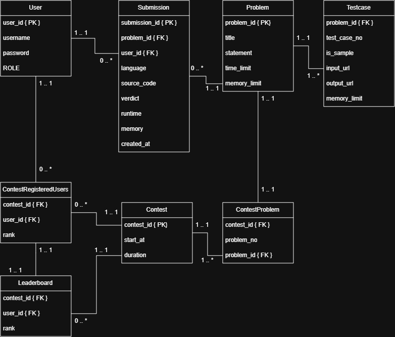

# Online Judge

> Online Judge is a collection of microservices to allow users to submit their code solution to a given algorithmic problem and receive a verdict against hidden testcases.

This project is built to practice microservices by cloning main functionalities of online judges such as Leetcode.

> Note: This project is in progress.

## Scope

- API Server acting as single entrypoint for the user with rate limiting, authentication and load balancing.
- Message Queue to handle large amount of submissions.
- Sandboxed Workers to safely execute user submitted code.
- Master and Slave DBs to separately handle reads and writes.
- Object Storage to store large binaries of testcases.


## Architecture (As per current progress)


### Context Diagram


### App Diagram


### Component Diagram

#### DB Service


## ERD


## Environment Variables
### Sample .env
```env
# DB
REPLICATION_PASSWORD=replicationPassword
POSTGRESQL_PASSWORD=admin

# minio (Object Storage)
MINIO_ROOT_USER=admin
MINIO_ROOT_PASSWORD=admin
```